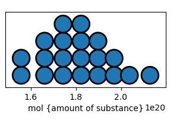

# SimpleFermi

A simple uncertainty and unit aware programming environment.  Think of it as ([frink](https://frinklang.org/) or [rink](https://github.com/tiffany352/rink-rs/)) + ([squiggle](https://www.squiggle-language.com/) or [MonteCarloMeasurements](https://github.com/baggepinnen/MonteCarloMeasurements.jl)), a less visual version of [Guesstimate](https://www.getguesstimate.com/) with units support. It's a realization of the [GUM Supplement on the Monte Carlo Method](https://www.bipm.org/documents/20126/2071204/JCGM_101_2008_E.pdf/325dcaad-c15a-407c-1105-8b7f322d651c).

It's a programming environment that lets you work easily with both units and a sense of uncertainty.

## Installation

		pip install git+https://git.alexalemi.com/alemi/simplefermi.git
		
		
Afterwards the library can be used from the command line with:

		python -m simplefermi
		
of you can launch an `ipython {console, qtconsole, notebook}` session and use it like a library with the recommended abbreviation:

		import simplefermi as sf
		
## Example Usage

Let's try to estimate how much the carbon dioxide in the atmosphere is rising due to human activity.  First let's estimate the 
total number of moles of gas in the atmosphere, we'll estimate that by starting with the mass of the atmosphere:

```python
atm_mass = (sf.sigfig('1.0', 'atm') / (sf.gravity * sf.percent(7)) * 4 * sf.pi * sf.earthradius**2).to_base_units()
```

Then we'll estimate the molar mass of the air by using our knowledge that its ~70% nitrogen and the rest oxygen and nitogren is 28 g/mol and oxygen is 32 g/mol

```python
f = sf.outof(70, 100)
atm_molarmass = f * sf.sigfig('28', 'g/mol') + (1-f) * sf.sigfig('32', 'g/mol')
atm_mole = atm_mass / atm_molarmass
```


Now let's estimate how much carbon dixode is released into the atmosphere each year.  I remember that globally we use ~18 TW of energy, and that ~80% of that comes from fossil fuels, and that fossil fuels are like fats and so have ~9 kcal/g of energy, and that for every gram of fossil fuels ~3 g of carbon dioxide is released, and carbon dioxide has a molecular mass of 32+12

```python
co2_mol = sf.db() * sf.Q(18, 'TW') * sf.outof(80, 100) / (sf.db() * sf.Q(9, 'kcal/g')) * (sf.db() * 3) / (sf.sigfig('12', 'g/mol') + sf.sigfig('32', 'g/mol'))
```


This let's us estimate how much carbon dixode is added to the atmosphere each year:

```python
(co2_mol / atm_mole).to('ppm/year')
```


## Core library

The basic datatype in `simplefermi` is a `Quantity` which represents both some value (potentially with uncertainty) as well as its units.

`Quantity` aka `Q` generates quantities. For example:
		* `Quantity(1, 'm/s')` represents 1 meter per second.
		* `Q(1, 'm')` represents 1 meter.
		* `Q(32, 'years')`
		* `Q(2, 'm') / Q(3, 's') == Q(2/3, 'm/s')` basic arithmetic works as expected.

### Distributions

	* `plusminus(mean, std)` - represents a number like 3 +/- 2, with a given mean and standard deviation.
	* `normal(left, right)` - represents a normal distribution between the given limits.
	* `timesdivide(mean, std)` - represents a number and some typical multiplicative variance.
	* `lognormal(low, high)` - represents a log normal distribution between the two limits, use this for most positive physical quantities.
	* `to(low, high)` - for both arguments being positive, its `lognormal`, else `normal`.

For percentages, there are some helpers:

  * `outof(part, whole)` - generates a beta distribution with the observed counts, 7 out of 10 and 70 out of 100 have the same mean but different concentrations.
	* `against(part, other)` - different phrasing, its often easier to estimate two opposing population sizes than it is to estimate fractions. 

You can also twiddle existing numbers:

  * `sigfig(string)` - will generate a uniform distribution consistent with the given value, interpreting it in terms of [sigfigs](https://en.wikipedia.org/wiki/Significant_figures), i.e. `sigfig('1.0')` is between 0.95 and 1.05 while `sigfig(1.)` is between 0.5 and 1.5.
	* `percent(percentage)` - will introduce some percentage error in an estimate (multiplicatively), if you know how things vary.
	* `db(decibels)` - introduces a multiplicative variation in terms of the decibels of relative error.

And you can use data to formulate distributions:

  * `data(values, weights=None)` - does bootstrap sampling from a finite set of values, use this for empirical measurements, optional weights give the weighting values.
	* `mixture(*sources, weights=None)` - generates a mixture distribution with the given weights.
	* `normalfit(values)` - fits a normal distribution to the given values, prefer to use `data`, but this has its uses.

## Library of Constants

All of the [CODATA18](https://pml.nist.gov/cuu/Constants/) physical constants are implemented with their measured errors, so you can use `hbar, stefan_boltzmann_constant, c` etc and they will reflect mankinds current accepted experimental uncertainty, though note that a lot of physical constants will become exact once CODATA2022 is finalized due to the [2019 redefinition of the SI base units](https://en.wikipedia.org/wiki/2019_redefinition_of_the_SI_base_units).

## Notebooks

If you want nice quantile dotplots, I recommend using either `jupyter qtconsole` or `juypter notebook` which
should automatically represent quantities with [quantile dotplots](https://github.com/mjskay/when-ish-is-my-bus/blob/master/quantile-dotplots.md).


